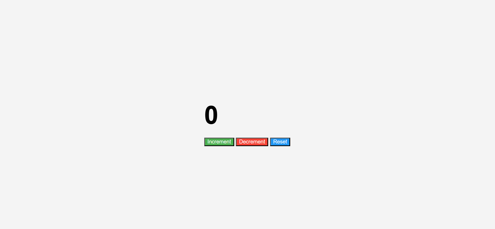

# Simple Counter App 🚀

This is a beginner-friendly web application that demonstrates the use of **HTML**, **CSS**, and **JavaScript** to create a simple counter with increment, decrement, and reset functionality.

## 🌟 Features

- Displays a counter that starts at `0`
- Three buttons:
  - ✅ **Increment**: Increases the count by 1
  - 🔽 **Decrement**: Decreases the count by 1
  - ♻️ **Reset**: Resets the counter to `0`
- Smooth, responsive design using **CSS**
- Interactive behavior using **vanilla JavaScript**
- Clean and minimal layout for beginners

## 📷 Preview

 <!-- Optional if you upload an image -->

## 🛠️ Tech Stack

- **HTML** - for structure
- **CSS** - for styling
- **JavaScript** - for interactivity

## 📂 Project Structure

